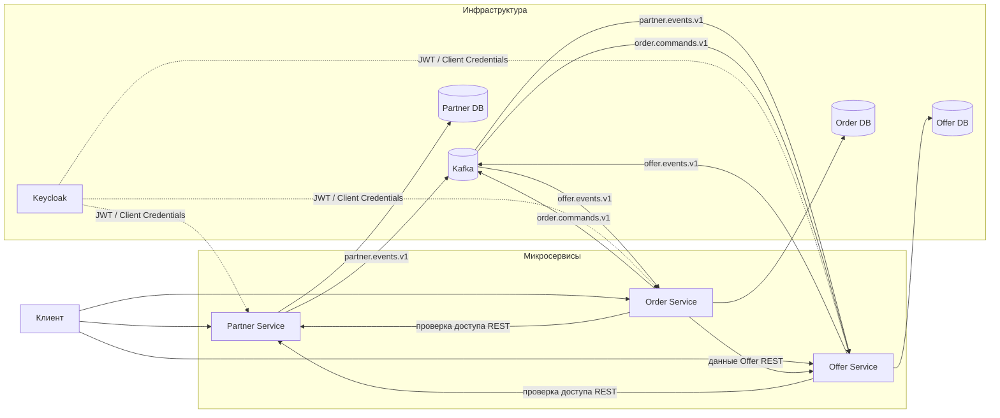

# FoodRescue

## О проекте

FoodRescue — сервис для реализации невостребованной еды. Магазины, кафе и другие заведения публикуют наборы еды по
сниженной цене, а покупатели находят доступные предложения, резервируют их и забирают в выбранном магазине.

Согласно отчёту *Driven to Waste*, опубликованному WWF в 2021 году, около 40% еды теряется или остаётся несъеденной по
всей цепочке поставок — до 2,5 млрд тонн в год, или около 79 тыс. кг каждую секунду. WWF связывает потери и пищевые
отходы
примерно с 10% глобальных выбросов парниковых газов. Project Drawdown также относит сокращение потерь и пищевых отходов
к
климатическим решениям с высоким потенциальным эффектом: в *The Drawdown Review* (2020) предотвращённые выбросы за
2020–2050 годы оцениваются в 86,7–93,8 Гт CO₂-экв. в двух рассмотренных сценариях.
([WWF, 2021](https://www.worldwildlife.org/publications/driven-to-waste-the-global-impact-of-food-loss-and-waste-on-farms/),
[Project Drawdown, 2020](https://drawdown.org/sites/default/files/pdfs/TheDrawdownReview%E2%80%932020%E2%80%93Download.pdf))

По своей идее FoodRescue близок к сервисам по сокращению пищевых отходов, таким как
[Too Good To Go](https://www.toogoodtogo.com/), [Karma](https://karma.life/app),
[Phenix](https://www.wearephenix.com/en/application-anti-waste/) и [ResQ Club](https://www.resq-club.com/):
заведение публикует невостребованные продукты или готовую еду со скидкой, пользователь выбирает предложение,
оформляет заказ и забирает его в заданное время.

Система состоит из трёх микросервисов: `partner-service`, `offer-service` и `order-service`. Каждый из них владеет своей
предметной областью и использует отдельную базу данных PostgreSQL. Синхронное взаимодействие реализовано по REST Api,
асинхронное —
через Kafka.

## Ролевая модель

Аутентификация и выдача ролей реализованы через Keycloak.

| Роль       | Основные возможности                                                                                                                                                          |
|------------|-------------------------------------------------------------------------------------------------------------------------------------------------------------------------------|
| `CUSTOMER` | Покупатель. Просматривает доступные `Offer`, оформляет `Order`, получает одноразовый код для выдачи и может отменять собственные заказы в рамках действующих правил.          |
| `STAFF`    | Сотрудник конкретного `Store`. Работает с `FoodBag` и `Offer` назначенного магазина, подтверждает выдачу заказов и может отменять допустимые `Order`.                         |
| `MANAGER`  | Представитель `Partner`. Управляет `Partner` и его `Store`, работает с `FoodBag` и `Offer`, а также может подтверждать выдачу и отменять заказы доступных магазинов.          |
| `ADMIN`    | Администратор системы. Имеет административный доступ к сценариям сервисов и не требует привязки к конкретному магазину там, где это предусмотрено текущими правилами доступа. |

Точные ограничения ролей, проверки принадлежности ресурсов пользователю и правила доступа описаны в README
соответствующих сервисов.

## Архитектура



## Структура проекта

```text
foodrescue/
├── services/
│   ├── partner-service/
│   ├── offer-service/
│   └── order-service/
├── postgres/
├── keycloak/
├── compose.yaml
├── .env.example
└── settings.gradle.kts
```

## Микросервисы

| Сервис            | Ответственность                                                                                                               |
|-------------------|-------------------------------------------------------------------------------------------------------------------------------|
| `Partner Service` | Управляет `Partner` и `Store`, хранит связи сотрудников с магазинами и проверяет доступ к ним.                                |
| `Offer Service`   | Управляет `FoodBag`, `Offer`, доступным количеством наборов и резервированием, формирует каталог предложений для покупателей. |
| `Order Service`   | Управляет жизненным циклом `Order`: оформление, резервирование, отмена, получение и платёжные операции.                       |

Подробности реализации:

- [Partner Service README](services/partner-service/partner-service-README.md)
- [Offer Service README](services/offer-service/offer-service-README.md)
- [Order Service README](services/order-service/order-service-README.md)

## Основной сценарий

1. `MANAGER` создаёт `Partner` и настраивает принадлежащий ему `Store`.
2. `STAFF` или `MANAGER` создаёт `FoodBag` — описание набора еды, который магазин готов продавать со скидкой.
3. На основе `FoodBag` создаётся `Offer`: указываются количество доступных наборов и время, в которое их можно забрать.
   После активации предложение появляется в каталоге.
4. `CUSTOMER` просматривает каталог и выбирает подходящий активный `Offer`.
5. Покупатель оформляет `Order` на нужное количество наборов.
6. Система проверяет актуальность предложения и наличие нужного количества, резервирует наборы и выполняет авторизацию
   оплаты. После успешного завершения этих действий `Order` переходит в `RESERVED`.
7. Для `RESERVED` заказа покупатель получает одноразовый код получения.
8. Покупатель приходит в указанный `Store` в пределах времени выдачи и сообщает код сотруднику.
9. `STAFF` или `MANAGER` подтверждает выдачу. Система проверяет, что сотрудник действительно имеет доступ к этому
   `Store`.
10. После подтверждения выполняется списание оплаты, а успешно выданный `Order` переходит в `COMPLETED`.

Отдельного Payment Service сейчас нет. Платёжная логика скрыта за `PaymentCommandPort`, а текущий локальный
`PaymentAdapter` имитирует успешное выполнение операций. Это позволяет проверить полный пользовательский сценарий без
отдельной платёжной системы.

## Технологии

- **Language / build:** Kotlin 2.3.21, Gradle
- **Backend:** Spring Boot 4.1.0, REST Api
- **Persistence:** PostgreSQL 17, Spring Data JPA / Hibernate, Liquibase
- **Messaging:** Apache Kafka 4.1.2
- **Authentication:** Keycloak 26.7.0, JWT, Spring Security и OAuth2
- **Testing:** JUnit 5, Mockito/MockWebServer.
- **Observability:** Zipkin

## Запуск проекта

Для локальной разработки `compose.yaml` поднимает инфраструктуру проекта: PostgreSQL, Kafka, Keycloak и Zipkin.
Сами `partner-service`, `offer-service` и `order-service` в Docker Compose сейчас не запускаются и должны быть запущены
отдельно как Spring Boot приложения.

### 1. Настроить переменные окружения

Создайте `.env` на основе `.env.example`:

```bash
cp .env.example .env
```

Задайте в нём локальные порты, параметры баз данных и настройки Keycloak.

Для межсервисной аутентификации значения `OFFER_SERVICE_CLIENT_ID`,
`OFFER_SERVICE_CLIENT_SECRET`, `ORDER_SERVICE_CLIENT_ID` и `ORDER_SERVICE_CLIENT_SECRET` должны соответствовать
клиентам, импортируемым в realm `foodrescue` из конфигурации Keycloak. Значения `example` в `.env.example` являются
заглушками и должны быть заменены.

### 2. Запустить инфраструктуру

Из корня проекта:

```bash
docker compose up -d
```

При первом запуске PostgreSQL создаёт отдельные базы данных для Partner Service, Offer Service, Order Service и
Keycloak.
Keycloak запускается с импортом realm из каталога `keycloak`.

Проверить состояние контейнеров можно командой:

```bash
docker compose ps
```

### 3. Запустить микросервисы

Запустите отдельно три Spring Boot приложения:

```text
partner-service
offer-service
order-service
```

Каждому приложению необходимо передать переменные окружения из `.env`. Порты сервисов задаются через
`PARTNER_SERVICE_PORT`, `OFFER_SERVICE_PORT` и `ORDER_SERVICE_PORT`.

После запуска состояние сервисов можно проверить через их health endpoint:

```text
${PARTNER_SERVICE_URL}/actuator/health
${OFFER_SERVICE_URL}/actuator/health
${ORDER_SERVICE_URL}/actuator/health
```

### 4. Остановить инфраструктуру

```bash
docker compose down
```
