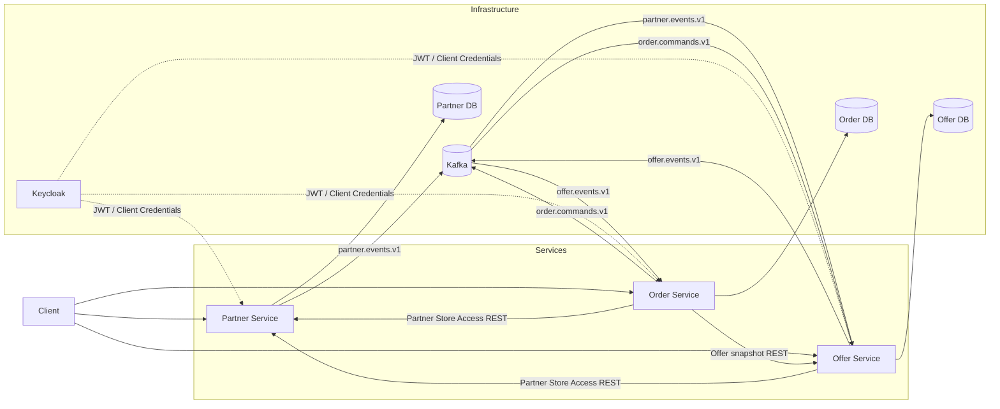

# FoodRescue

## О проекте

FoodRescue — сервис для реализации невостребованной еды. Магазины, кафе и другие заведения публикуют наборы еды по
сниженной цене, а покупатели находят доступные предложения, резервируют их и забирают в выбранном магазине.

Согласно отчету *Driven to Waste*, выпущенном WWF в 2021, около 40% еды теряется или остаётся несъеденной, по всей
цепочке поставок — до 2,5 млрд тонн в год, это около 79 тыс. кг каждую секунду. WWF связывает ~~food loss and waste~~ с
около 10% глобальных выбросов парниковых газов. Project Drawdown также относит сокращение ~~food loss and waste~~ к
климатическим решениям с высоким потенциальным эффектом.
В *The Drawdown Review* (2020) оценивает в 86,7–93,8 ГТ CO₂ предотвращённых выбросов в 2020–2050 годах в двух
рассмотренных сценариях. ([WWF, 2021](https://www.worldwildlife.org/publications/driven-to-waste-the-global-impact-of-food-loss-and-waste-on-farms/), [Project Drawdown, 2020](https://drawdown.org/sites/default/files/pdfs/TheDrawdownReview%E2%80%932020%E2%80%93Download.pdf))

Суть FoodRescue аналогична таким ~~anti-food-waste~~ сервисам,
как [Too Good To Go](https://www.toogoodtogo.com/), [Karma](https://karma.life/app),
[Phenix](https://www.wearephenix.com/en/application-anti-waste/) и [ResQ Club](https://www.resq-club.com/): продавец
публикует невостребованные продукты или готовую еду со скидкой, пользователь выбирает предложение, резервирует его и
забирает в заданное время.

Система состоит из трёх микросервисов: `partner-service`, `offer-service` и `order-service`. Каждый из них владеет своей
предметной областью и отдельной PostgreSQL database; синхронное взаимодействие реализовано по REST Api, асинхронное —
через Kafka.

## Ролевая модель

Механизм аутентификации и авторизации реализован через Keycloak.

| Роль       | Основные возможности                                                                                                                                                |
|------------|---------------------------------------------------------------------------------------------------------------------------------------------------------------------|
| `CUSTOMER` | Покупатель. Оформляет заказы на доступные предложения наборов еды.                                                                                                  |
| `STAFF`    | Персонал магазина. Работает с `FoodBag` и `Offer` назначенного магазина, а также подтверждает выдачу и может отменять допустимые Order этого Store.                 |
| `MANAGER`  | Партнер. Управляет своим `Partner` (партнером/сетью магазинов) и его `Store` может подтверждать выдачу и отменять Order доступного Store.                           |
| `ADMIN`    | Администратор. Имеет административный доступ к сценариям сервисов и не требует привязки к конкретным магазинам там, где это предусмотрено текущими правами доступа. |

Конкретные ограничения каждой роли, ownership-проверки и правила доступа описаны в README соответствующего сервиса.

## Архитектура



## Микросервисы

| Сервис            | Ответственность                                                                                                       |
|-------------------|-----------------------------------------------------------------------------------------------------------------------|
| `Partner Service` | Управляет `Partner` и `Store`, хранит связи сотрудников с их магазинами и проверяет управленческий доступ к магазину. |
| `Offer Service`   | Управляет `FoodBag`, `Offer`, процессами связанными с предложениями.                                                  |
| `Order Service`   | Управляет `Order`, customer flow, reservation orchestration, pickup, cancellation и платёжной абстракцией.            |

Подробности реализации:

- [Partner Service README](services/partner-service/partner-service-README.md)
- [Offer Service README](services/offer-service/offer-service-README.md)
- [Order Service README](services/order-service/order-service-README.md)

## Основной сценарий

1. `MANAGER` создаёт или настраивает `Partner` и принадлежащий ему `Store` через Partner Service.
2. После создания или изменения Store Partner Service сохраняет событие через Transactional Outbox и публикует его в
   `partner.events.v1`.
3. Offer Service получает Partner/Store event и обновляет локальный `StoreSnapshot`, используемый в публичных сценариях.
4. `STAFF`/`MANAGER` создаёт `FoodBag`; для предложения используется активный `FoodBag`.
5. На основе `FoodBag` создаётся `Offer`, после чего допустимое предложение переводится из `SCHEDULED` в `ACTIVE` и
   становится доступным в каталоге.
6. `CUSTOMER` выбирает активный Offer и создаёт `Order` через Order Service.
7. Order Service синхронно получает актуальный Offer snapshot из Offer Service, сохраняет Order в `PENDING` и записывает
   reservation command в локальный Outbox.
8. Сообщение `order.reservation-requested` публикуется в `order.commands.v1`; после успешного резервирования Offer
   Service публикует `offer.reserved` в `offer.events.v1`.
9. Order Service получает `offer.reserved`, выполняет текущую локальную payment authorization и при успехе переводит
   Order в `RESERVED`, одновременно создавая `order.reservation-commit-requested`.
10. `CUSTOMER` запрашивает одноразовый код получения для `RESERVED` Order.
11. `STAFF`/`MANAGER` подтверждает выдачу. Order Service проверяет доступ пользователя к конкретному
    Store через Partner Service и переводит Order в `PICKED_UP`.
12. Order Service запускает capture; текущий локальный `PaymentAdapter` возвращает успешный результат синхронно, после
    чего Order переходит в `COMPLETED`.

Отдельного Payment Service сейчас нет: платёжные операции скрыты за `PaymentCommandPort`, а текущая реализация
использует локальный `PaymentAdapter`.

## Технологии

- **Language / build:** Kotlin 2.3.21, Gradle
- **Backend:** Spring Boot 4.1.0, REST Api
- **Persistence:** PostgreSQL 17, Spring Data JPA / Hibernate, Liquibase
- **Messaging:** Apache Kafka 4.1.2
- **Authentication:** Keycloak 26.7.0, JWT, Spring Security и OAuth2
- **Testing:** JUnit 5, Mockito/MockWebServer.
- **Observability:** Zipkin

## Структура проекта

```text
foodrescue/
├── services/
│   ├── partner-service/
│   ├── offer-service/
│   └── order-service/
├── postgres/
├── keycloak/
├── compose.yaml
├── .env.example
└── settings.gradle.kts
```
