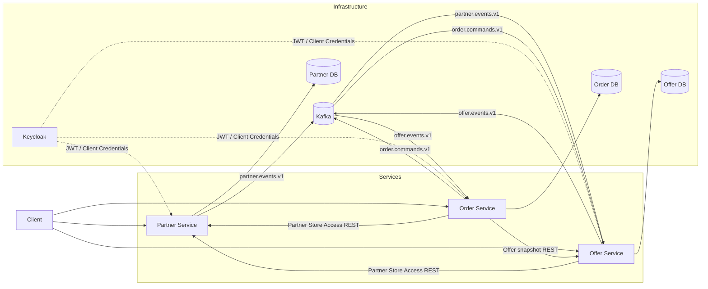

# FoodRescue

## О проекте

FoodRescue — backend pet-проект для сценария продажи еды, которая иначе могла бы остаться невостребованной. Магазины,
кафе и другие заведения публикуют наборы с ограниченным количеством, сниженной ценой и окном выдачи, а покупатели
находят доступные предложения, резервируют их и забирают в выбранном Store.

По оценке WWF в отчёте *Driven to Waste* (2021), около 40% еды, производимой для потребления человеком, теряется или
остаётся несъеденной по всей цепочке поставок — до 2,5 млрд тонн в год, то есть примерно 79 тыс. кг каждую секунду. WWF
связывает food loss and waste примерно с 10% глобальных выбросов парниковых газов. Project Drawdown также относит
сокращение food loss and waste к климатическим решениям с высоким потенциальным эффектом;
В *The Drawdown Review* (2020) для него оценивалось 86,7–93,8 ГТ CO₂ предотвращённых выбросов в 2020–2050 годах в двух
рассмотренных сценариях. ([WWF, 2021](https://www.worldwildlife.org/publications/driven-to-waste-the-global-impact-of-food-loss-and-waste-on-farms/), [Project Drawdown, 2020](https://drawdown.org/sites/default/files/pdfs/TheDrawdownReview%E2%80%932020%E2%80%93Download.pdf))

По продуктовой идее FoodRescue относится к тому же классу anti-food-waste сервисов,
что [Too Good To Go](https://www.toogoodtogo.com/), [Karma](https://karma.life/app), [Phenix](https://www.wearephenix.com/en/application-anti-waste/)
и [ResQ Club](https://www.resq-club.com/): бизнес публикует невостребованные продукты или готовую еду со скидкой,
пользователь выбирает предложение, резервирует его и забирает в заданное время. FoodRescue не воспроизводит
конкретный внешний продукт, а реализует аналогичный предметный сценарий как микросервисный backend pet-проект.

Текущая реализация состоит из трёх взаимодействующих микросервисов: `partner-service`, `offer-service` и
`order-service`. Каждый сервис владеет своей предметной областью и отдельной PostgreSQL database; синхронные проверки
выполняются по REST, а изменения состояния и reservation flow между сервисами передаются через Kafka.

## Ролевая модель

Роли пользователей хранятся в Keycloak и используются сервисами для авторизации бизнес-операций.

| Роль       | Основные возможности                                                                                                                                          |
|------------|---------------------------------------------------------------------------------------------------------------------------------------------------------------|
| `CUSTOMER` | Просматривает каталог, создаёт собственные Order, получает историю и pickup token, отменяет свой Order по действующим правилам.                               |
| `STAFF`    | Работает с `FoodBag` и `Offer` назначенного Store, а также подтверждает выдачу и может отменять допустимые Order этого Store.                                 |
| `MANAGER`  | Управляет своим `Partner` и его `Store`, а также связанными management-сценариями Offer Service; может подтверждать выдачу и отменять Order доступного Store. |
| `ADMIN`    | Имеет административный доступ к сценариям сервисов и не требует Partner/Store assignment там, где это предусмотрено текущими access policy.                   |

Конкретные ограничения каждой роли, ownership-проверки и правила доступа описаны в README соответствующего сервиса.

## Архитектура



Код сервисов организован в стиле **hexagonal architecture (ports and adapters)**. Application/domain logic не обращается
напрямую к конкретным HTTP-клиентам, Kafka, persistence framework или платёжной реализации: use case работают через
порты. Например, межсервисные вызовы скрыты за `PartnerStoreAccessPort` и `OfferQueryPort`, платёжные операции Order
Service — за `PaymentCommandPort`, а публикация доменных событий — за `DomainEventPublisherPort` и Outbox-механизмом.

Входными adapters выступают REST controllers, Kafka consumers и scheduler jobs; выходными — persistence adapters на
JPA/Hibernate, `RestClient`-клиенты других сервисов, Kafka/Outbox publishers и текущий локальный `PaymentAdapter`. Для
этого проекта такое разделение даёт несколько практических преимуществ:

- бизнес-правила use case можно тестировать изолированно, подменяя порты без реальных PostgreSQL, Kafka, Keycloak и
  соседних сервисов;
- инфраструктурные детали REST/Kafka/JPA остаются на границе сервиса и не смешиваются с правилами `Partner`, `Offer` и
  `Order`;
- временный локальный `PaymentAdapter` можно заменить внешней платёжной интеграцией через тот же `PaymentCommandPort`,
  не переписывая основной Order flow;
- синхронные и асинхронные интеграции оформлены явными контрактами, поэтому изменение конкретного adapter меньше
  затрагивает application layer.

`compose.yaml` поднимает общую локальную инфраструктуру: PostgreSQL, Kafka, Keycloak и Zipkin. В одном PostgreSQL
container создаются отдельные databases для `partner-service`, `offer-service`, `order-service` и Keycloak. Сами
application services подключены к Gradle-проекту как отдельные модули и в текущий `compose.yaml` не входят.

## Микросервисы

| Сервис            | Ответственность                                                                                                           | Основные интеграции                                                                                                                                                                                                |
|-------------------|---------------------------------------------------------------------------------------------------------------------------|--------------------------------------------------------------------------------------------------------------------------------------------------------------------------------------------------------------------|
| `Partner Service` | Управляет `Partner` и `Store`, хранит назначения пользователей и проверяет управленческий доступ к магазину.              | Предоставляет внутренний Partner Store Access REST API; публикует изменения Partner/Store в `partner.events.v1`.                                                                                                   |
| `Offer Service`   | Управляет `FoodBag`, `Offer`, каталогом и резервами количества. Хранит локальные Store snapshots для публичных сценариев. | Проверяет management-доступ через Partner Service; получает `partner.events.v1`; участвует в reservation flow с Order Service через `order.commands.v1` / `offer.events.v1`; предоставляет Offer snapshot по REST. |
| `Order Service`   | Управляет `Order`, customer flow, reservation orchestration, pickup, cancellation и платёжной абстракцией.                | Получает Offer snapshot из Offer Service; публикует `order.commands.v1` и обрабатывает `offer.events.v1`; проверяет доступ STAFF/MANAGER через Partner Service.                                                    |

Подробности реализации:

- [Partner Service README](services/partner-service/offer-service-README.md)
- [Offer Service README](services/offer-service/order-service-README.md)
- [Order Service README](services/order-service/partner-service-README.md)

## Основной сценарий

1. `MANAGER` создаёт или настраивает `Partner` и принадлежащий ему `Store` через Partner Service.
2. После создания или изменения Store Partner Service сохраняет событие через Transactional Outbox и публикует его в
   `partner.events.v1`.
3. Offer Service получает Partner/Store event и обновляет локальный `StoreSnapshot`, используемый в публичных сценариях.
4. `STAFF`/`MANAGER` создаёт `FoodBag`; для предложения используется активный `FoodBag`.
5. На основе `FoodBag` создаётся `Offer`, после чего допустимое предложение переводится из `SCHEDULED` в `ACTIVE` и
   становится доступным в каталоге.
6. `CUSTOMER` выбирает активный Offer и создаёт `Order` через Order Service.
7. Order Service синхронно получает актуальный Offer snapshot из Offer Service, сохраняет Order в `PENDING` и записывает
   reservation command в локальный Outbox.
8. Команда `order.reservation-requested` публикуется в `order.commands.v1`; после успешного резервирования Offer Service
   публикует `offer.reserved` в `offer.events.v1`.
9. Order Service получает `offer.reserved`, выполняет текущую локальную payment authorization и при успехе переводит
   Order в `RESERVED`, одновременно создавая `order.reservation-commit-requested`.
10. `CUSTOMER` запрашивает одноразовый pickup token для `RESERVED` Order.
11. `STAFF`/`MANAGER` подтверждает выдачу по pickup token. Order Service проверяет доступ пользователя к конкретному
    Store через Partner Service и переводит Order в `PICKED_UP`.
12. Order Service запускает capture; текущий локальный `PaymentAdapter` возвращает успешный результат синхронно, после
    чего Order переходит в `COMPLETED`.

Отдельного Payment Service сейчас нет: платёжные операции скрыты за `PaymentCommandPort`, а текущая реализация
использует локальный `PaymentAdapter`.

## Сценарии сервисов

### Partner Service

```text
Partner → Store → изменение состояния → Transactional Outbox → partner.events.v1
```

Partner Service является источником данных о Partner/Store и точкой синхронной проверки доступа для management-операций
других сервисов.

### Offer Service

```text
partner.events.v1 → StoreSnapshot
FoodBag → Offer → ACTIVE → каталог
order.commands.v1 → reservation → offer.events.v1
```

Offer Service отделяет management-сценарии от публичного чтения: права проверяются через Partner Service, а видимость
Offer определяется в том числе локальным состоянием Store snapshot.

### Order Service

```text
Offer snapshot REST → PENDING
→ order.commands.v1 → offer.events.v1
→ payment authorization → RESERVED
→ pickup token → pickup confirmation
→ capture → COMPLETED
```

Order Service оркестрирует customer flow, но не владеет данными Offer или Store и использует их через интеграционные
контракты соответствующих сервисов.

## Технологии

- **Language / build:** Kotlin 2.3.21, Java 21, Gradle Kotlin DSL, multi-module Gradle project.
- **Backend:** Spring Boot 4.1.0, Spring MVC, Validation, Spring Security, OAuth2 Resource Server; OAuth2 Client и
  `RestClient` используются для межсервисных REST-вызовов.
- **Persistence:** PostgreSQL 17, Spring Data JPA / Hibernate, Liquibase; каждый application service использует
  отдельную database.
- **Messaging:** Apache Kafka 4.1.2 и Spring Kafka; для надёжной публикации и обработки асинхронных сообщений
  используются Transactional Outbox и, где требуется, Inbox/deduplication.
- **Authentication:** Keycloak 26.7.0, JWT и OAuth2 Client Credentials для service-to-service REST-вызовов.
- **Testing / code quality:** JUnit 5, Testcontainers, Mockito/MockWebServer там, где они нужны; Spotless и ktfmt.
- **Observability:** Zipkin присутствует в локальной инфраструктуре; сервисы используют tracing-интеграции, описанные в
  их README.

## Структура проекта

```text
foodrescue/
├── services/
│   ├── partner-service/
│   ├── offer-service/
│   └── order-service/
├── postgres/
├── keycloak/
├── compose.yaml
├── .env.example
└── settings.gradle.kts
```

`settings.gradle.kts` подключает три application module: `:services:partner-service`, `:services:offer-service` и
`:services:order-service`. Конкретные REST endpoints, domain model, статусы, access rules, Kafka payloads, Outbox/Inbox
и scheduler configuration описаны в README соответствующих сервисов.
